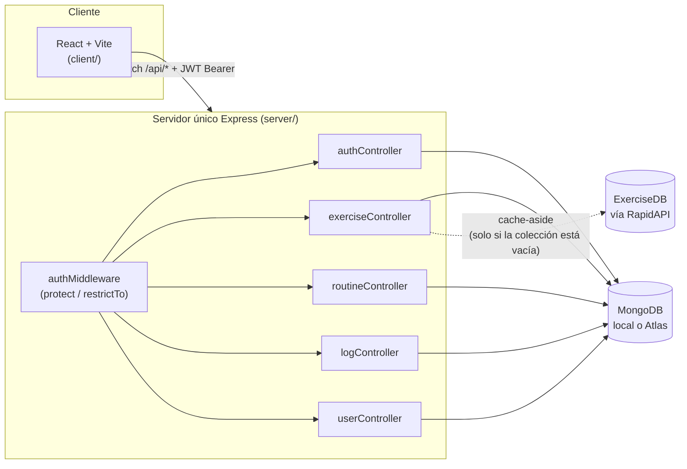
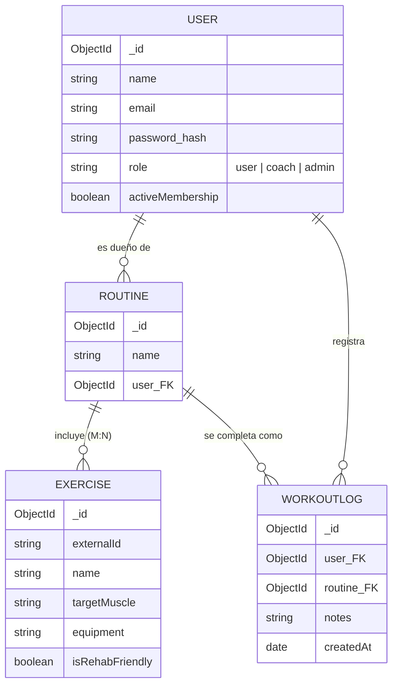
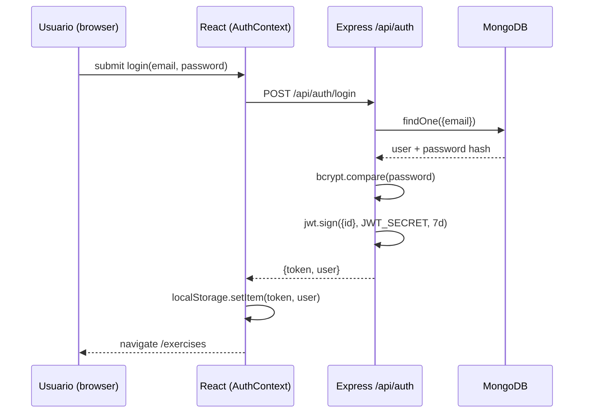
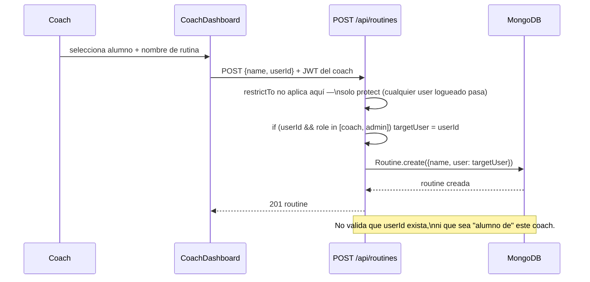

# 3. Arquitectura actual (estado real del código)

Este documento describe lo que **existe hoy** en el repo, no una aspiración. Sirve como línea de base para medir qué falta para vender el producto.

## Diagrama de componentes

**Punto crítico de diseño**: todo vive en un único proceso Express + una única base Mongo, sin separación por tenant. No hay load balancer, no hay caché compartido (Redis), no hay cola de trabajos. Para el volumen de un MVP/beta esto es correcto — no hay que sobre-construir antes de tener usuarios.

## Modelo de datos (ER)

**Gap de negocio visible en el modelo**: no existe una entidad `Gym`/`Tenant` ni una relación explícita `Coach—Alumno`. El campo `role` alcanza para autorización pero no para "estos son los alumnos de este coach" ni para "este gimnasio tiene estos coaches". Por eso hoy cualquier coach puede asignar una rutina a cualquier `userId` del sistema (ver hallazgo de seguridad en la revisión previa).

## Flujo de autenticación (lo que hay)

Sin refresh token, sin revocación, sin rate limiting en este endpoint — ver [06-riesgos-y-metricas.md](06-riesgos-y-metricas.md).

## Flujo "coach asigna rutina" (el feature de negocio central, tal cual está hoy)

## Inventario de deuda técnica que bloquea venta (resumen)

| Ítem | Por qué bloquea vender | Detalle |
|---|---|---|
| Sin Stripe real | No hay forma de cobrar | `activeMembership` se activa a mano desde el panel admin |
| Sin multi-tenant | Un gimnasio no puede tener "su" espacio aislado | Todos los usuarios comparten un namespace global |
| Sin relación coach↔alumno | El feature de venta principal (gestión de alumnos) es endeble | Cualquier coach ve/asigna a cualquier usuario |
| Sin rate limiting / helmet | Riesgo de seguridad ante tráfico real | `server/index.js` solo tiene `cors()` y `express.json()` |
| Sin paginación | No escala con catálogo/usuarios reales | `GET /exercises`, `/users`, `/logs` devuelven todo sin límite |
| Sin tests/CI | Cada release es a ciegas | No hay `.github/workflows`, no hay test runner configurado |

Este inventario es el insumo directo del roadmap en [05-roadmap.md](05-roadmap.md).
