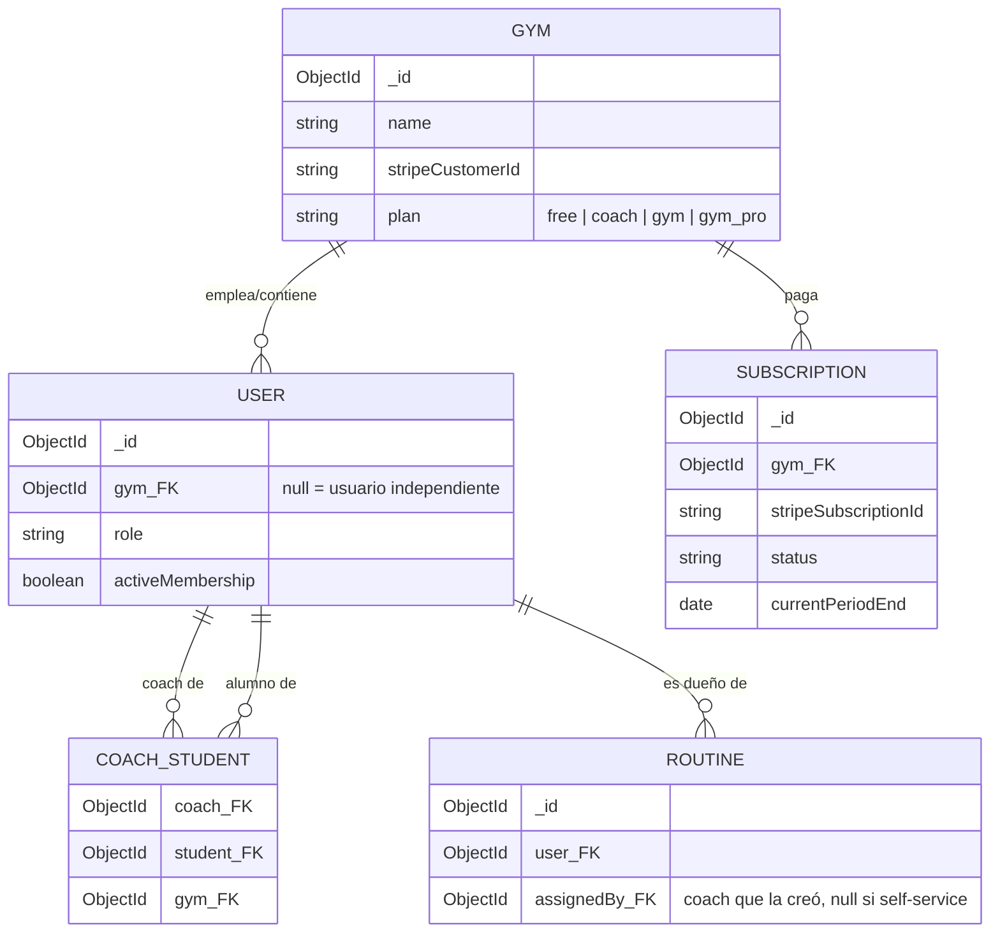
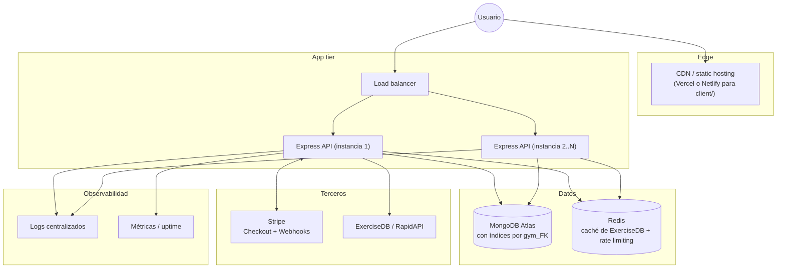
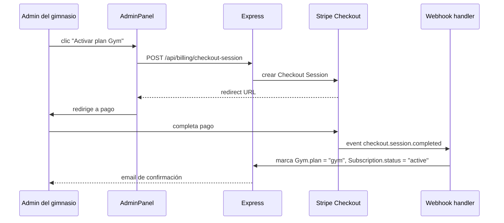

# 4. Arquitectura objetivo (para vender a gimnasios reales)

No es una reescritura — es la evolución incremental del mismo Express + Mongo, agregando lo que el modelo de negocio necesita: multi-tenant, cobro real y observabilidad. Filosofía: **escalar cuando duela, no antes**.

## Cambios al modelo de datos

**Por qué `COACH_STUDENT` como tabla propia y no un array en `User`**: permite que un alumno tenga más de un coach a lo largo del tiempo (historial), y que las queries "alumnos de este coach" sean un índice directo en vez de un scan.

## Arquitectura de despliegue objetivo

## Flujo de cobro objetivo (hoy no existe, hay que construirlo)

Esto reemplaza el toggle manual de `activeMembership` en el AdminPanel actual por un flujo real de cobro recurrente.

## Qué NO construir todavía (sobre-ingeniería a evitar)

- **Microservicios**: con el volumen esperado de una beta/early-stage, un monolito Express bien dividido en módulos alcanza. Separar servicios agrega complejidad operativa sin beneficio hasta tener tráfico real que lo justifique.
- **Kubernetes**: un PaaS (Render, Railway, Fly.io) o un par de instancias detrás de un load balancer simple es suficiente hasta escala media.
- **Mobile app nativa**: el roadmap prioriza que la web sea responsive y funcione bien en mobile antes de invertir en una app nativa — ver [05-roadmap.md](05-roadmap.md).

## Stack de observabilidad mínimo viable

| Necesidad | Solución de bajo costo |
|---|---|
| Logs | Pino/Winston → stdout → servicio gestionado (e.g. Better Stack, Axiom) |
| Errores en frontend/backend | Sentry (free tier alcanza para early stage) |
| Uptime | UptimeRobot o Better Uptime sobre `/api/health` (hay que hacer que ese endpoint chequee Mongo real, hoy no lo hace) |
| Métricas de negocio | Eventos simples a una tabla propia o PostHog (self-host u open source friendly) |
