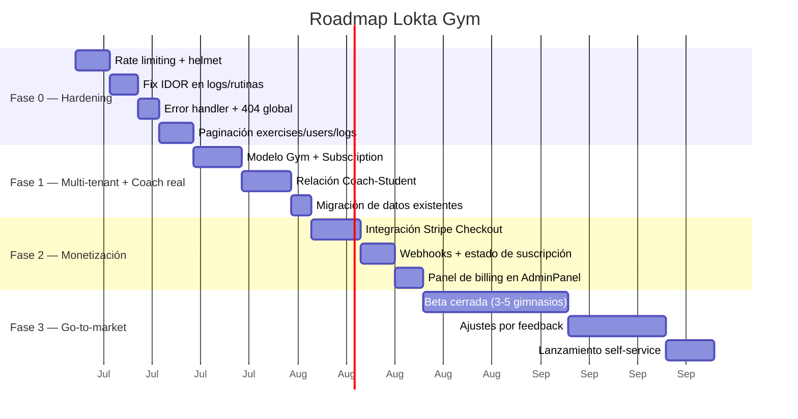

# 5. Roadmap de delivery

Cuatro fases. Cada fase tiene un criterio de salida concreto — no se avanza a la siguiente sin cumplirlo.

## Fase 0 — Hardening (antes de mostrarle esto a un cliente pago)

**Objetivo**: que el producto no se caiga ni filtre datos el primer día que un gimnasio real lo use.

| Tarea | Por qué | Referencia |
|---|---|---|
| Rate limiting + helmet en `server/index.js` | Login sin límite de intentos hoy | [03-arquitectura-actual.md](03-arquitectura-actual.md) |
| Validar ownership en `createLog`/`createRoutine` | IDOR detectado en revisión de código | ídem |
| Error handler centralizado + 404 | Hoy cada controller filtra `error.message` crudo | ídem |
| Paginación en endpoints de listado | No escala con catálogo/usuarios reales | ídem |

**Criterio de salida**: cero hallazgos críticos en un `/security-review` del repo.

## Fase 1 — Multi-tenant + relación Coach↔Alumno

**Objetivo**: que el feature de venta principal (un gimnasio gestiona sus coaches y alumnos) sea real, no una ilusión de UI.

- Agregar entidades `Gym` y `CoachStudent` (ver [04-arquitectura-objetivo.md](04-arquitectura-objetivo.md)).
- Migrar usuarios existentes a un `Gym` por defecto (no rompe la beta actual).
- Restringir `restrictTo('coach')` para que solo pueda operar sobre alumnos de su propio gym/relación.

**Criterio de salida**: un coach solo puede ver y asignar rutinas a alumnos vinculados a él.

## Fase 2 — Monetización real

**Objetivo**: reemplazar el toggle manual de `activeMembership` por un cobro recurrente real.

- Stripe Checkout para el plan del gimnasio.
- Webhook que actualiza `Subscription.status`.
- El AdminPanel pasa de "activar membresía a mano" a "ver estado de facturación".

**Criterio de salida**: un gimnasio de prueba puede pagar con tarjeta y el sistema refleja el estado solo.

## Fase 3 — Go-to-market

**Objetivo**: validar willingness-to-pay antes de invertir en adquisición.

- Beta cerrada con 3–5 gimnasios/coaches reales, gratis a cambio de feedback estructurado.
- Iterar sobre fricción real de onboarding (no hipótesis).
- Recién ahí, lanzamiento self-service para coaches independientes.

**Criterio de salida**: al menos 1 gimnasio de la beta dispuesto a pagar el plan "Gym" en condiciones normales.

## Fuera de alcance (deliberadamente, por ahora)

- App móvil nativa — la web responsive cubre el caso de uso mientras el volumen sea bajo.
- Microservicios / Kubernetes — ver justificación en [04-arquitectura-objetivo.md](04-arquitectura-objetivo.md).
- Integraciones de control de acceso físico (torniquetes, biometría) — son feature de "Gym Pro" a futuro, no de la versión vendible inicial.
