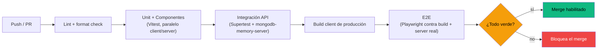

# 2. Pipeline de CI y casos de prueba críticos

## Pipeline propuesto (GitHub Actions)



**Gating**: lint + unit + integración corren en *todos* los PR (rápidos, < 3 min). E2E corre en PR contra `main` y en cada push a `main` (más lento, pero es lo que protege los flujos de negocio). El scan de OWASP ZAP corre aparte, nocturno contra staging — no bloquea PRs.

## Estrategia de datos de test

- **Integración backend**: `mongodb-memory-server` levanta una instancia nueva por archivo de test (o por worker) — nunca toca Mongo Atlas real. Seed mínimo con `@faker-js/faker` en un `beforeEach`.
- **E2E frontend**: backend real corriendo contra una base de test dedicada (no memoria, porque Playwright necesita persistencia entre pasos), reseteada vía un script `npm run db:seed:test` antes de la suite. Login en los tests se hace vía `request.post('/api/auth/login')` de Playwright (no clickeando el form) para no gastar tiempo de CI repitiendo el mismo flujo en cada test que no sea específicamente "test de login".

## Casos de prueba prioritarios (mapeados a hallazgos reales)

Estos casos no son genéricos — vienen directo de la revisión de código de `server/controllers/`. Idealmente se escriben **antes** de aplicar el fix correspondiente (rojo → verde), así quedan como criterio de aceptación de la Fase 0 del roadmap.

| # | Caso | Tipo | Hoy (sin fix) |
|---|---|---|---|
| 1 | Usuario A no puede `GET/PUT/DELETE /api/routines/:id` de Usuario B | Integración | Pasa (`routineController` ya filtra por `user: req.user._id`) |
| 2 | Usuario A **sí puede** crear un `WorkoutLog` apuntando al `routineId` de Usuario B | Integración (regresión de bug) | **Falla** — `logController.createLog` no valida ownership, hoy lo permite |
| 3 | Un coach solo debería poder asignar rutinas a userIds válidos | Integración | **Falla** — acepta cualquier `userId` existente o no, sin relación coach-alumno |
| 4 | Después de N intentos fallidos de login, el endpoint responde 429 | Integración + k6 | **Falla** — no hay rate limiting implementado |
| 5 | Un `user` normal no puede pegarle a `PUT /api/users/:id/role` | Integración | Pasa (`restrictTo('admin')` ya lo cubre) |
| 6 | El frontend redirige a `/login` cuando una respuesta da 401 (token expirado) | E2E | **Falla** — hoy cada página solo muestra un mensaje de error genérico |
| 7 | El catálogo de ejercicios responde con paginación, no la colección completa | Integración | **Falla** — `GET /api/exercises` no pagina |

Los casos marcados "Falla" son intencionalmente el primer commit de cada item de la Fase 0 del roadmap: se escribe el test rojo, se implementa el fix, el test pasa a verde, y queda de regresión para siempre.

## Ejemplo — test de integración (caso #2, el IDOR de logs)

```js
// server/__tests__/logs.idor.test.js
import { describe, it, expect, beforeEach } from 'vitest';
import request from 'supertest';
import app from '../index.js';
import { createUserWithToken, createRoutineFor } from './helpers';

describe('POST /api/logs — ownership', () => {
  it('no debe permitir loguear un entrenamiento sobre una rutina ajena', async () => {
    const userA = await createUserWithToken();
    const userB = await createUserWithToken();
    const routineDeA = await createRoutineFor(userA);

    const res = await request(app)
      .post('/api/logs')
      .set('Authorization', `Bearer ${userB.token}`)
      .send({ routineId: routineDeA._id });

    // Hoy esto responde 201 — el fix debe hacer que responda 403/404
    expect(res.status).toBe(403);
  });
});
```

## Ejemplo — E2E del flujo de negocio central (Playwright)

```js
// e2e/coach-asigna-rutina.spec.ts
import { test, expect } from '@playwright/test';
import { loginViaApi } from './helpers';

test('coach asigna una rutina a su alumno y el alumno la ve', async ({ page, request }) => {
  const coach = await loginViaApi(request, 'coach@test.com');
  const alumno = await loginViaApi(request, 'alumno@test.com');

  await page.goto('/coach');
  await page.getByLabel('Alumno').selectOption({ label: /alumno@test.com/ });
  await page.getByLabel('Nombre de la rutina').fill('Push Day E2E');
  await page.getByRole('button', { name: 'Asignar rutina' }).click();
  await expect(page.getByText('Rutina asignada correctamente')).toBeVisible();

  // cambiar de sesión al alumno y verificar que la ve
  await page.context().clearCookies();
  await loginViaApi(request, 'alumno@test.com');
  await page.goto('/routines');
  await expect(page.getByText('Push Day E2E')).toBeVisible();
});
```

## Definition of Done propuesta (para nuevas features, no solo bugfixes)

Toda PR que toque `controllers/` o páginas con lógica de auth/roles debe incluir:

1. Al menos un test de integración que cubra el caso "usuario sin permiso intenta la acción".
2. Si toca un flujo de negocio visible en el roadmap (asignación de rutinas, billing futuro), un E2E o la actualización de uno existente.
3. Sin baja de cobertura en `controllers/`/`services/` respecto al baseline.
