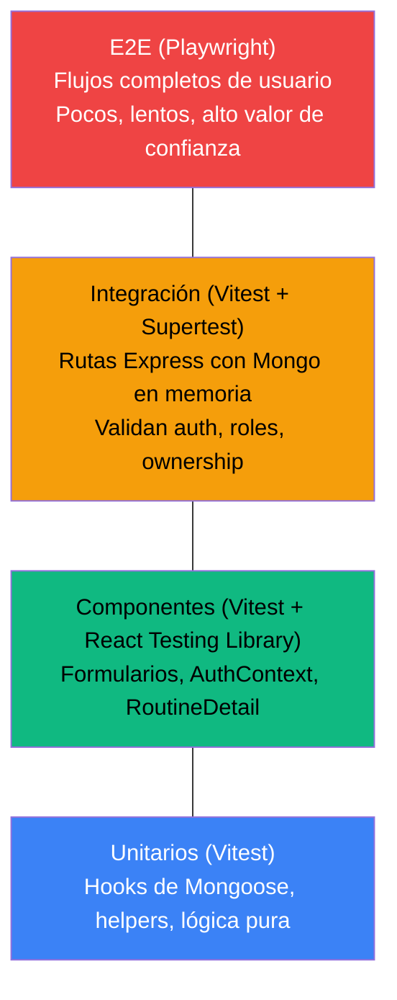

# Estrategia de QA Automation — Lokta Gym

Plan de automatización de testing para backend (Express/Mongo) y frontend (React/Vite), pensado para un equipo chico que no puede mantener tres frameworks de test distintos.

## Índice

1. [Herramientas recomendadas](01-herramientas.md)
2. [Pipeline de CI y casos de prueba críticos](02-ci-pipeline-y-casos-criticos.md)

## Principio rector

**Un solo test runner para todo el repo.** El proyecto ya usa Vite en el cliente — Vitest es compatible con ESM/Node sin bundler, así que sirve tanto para tests de backend (Node puro) como de frontend (componentes React), compartiendo config, reporters y forma de escribir asserts. Evita el problema clásico de "Jest en el server, Vitest en el client, dos configuraciones de mocking distintas, dos curvas de aprendizaje".

## Pirámide de testing objetivo

La proporción importa más que la herramienta: muchos tests unitarios/de componentes (rápidos, baratos de mantener), bastante menos integración, y un puñado de E2E que cubran los flujos de negocio que de verdad importan (registro→login→crear rutina→completar entrenamiento; coach asigna rutina a alumno; admin cambia rol/membresía).

## Por qué esto no es opcional para este proyecto en particular

La revisión de código y el plan de negocio (`docs/business-plan/`) ya identificaron bugs de autorización reales (IDOR en `createLog` y en asignación de rutinas — ver [03-arquitectura-actual.md](../business-plan/03-arquitectura-actual.md)). Sin tests de integración que verifiquen "el usuario B no puede tocar datos del usuario A", esos bugs vuelven cada vez que alguien toca `routineController.js` o `logController.js`. La automatización acá no es higiene genérica — es la única forma de que el roadmap de "Fase 0 — Hardening" no se desande con el primer refactor.
